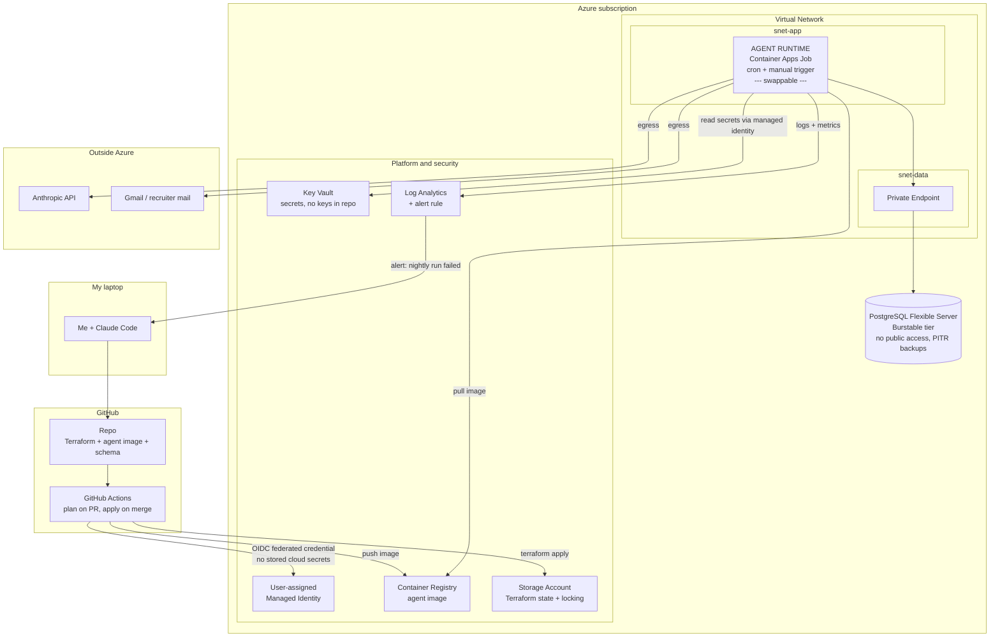
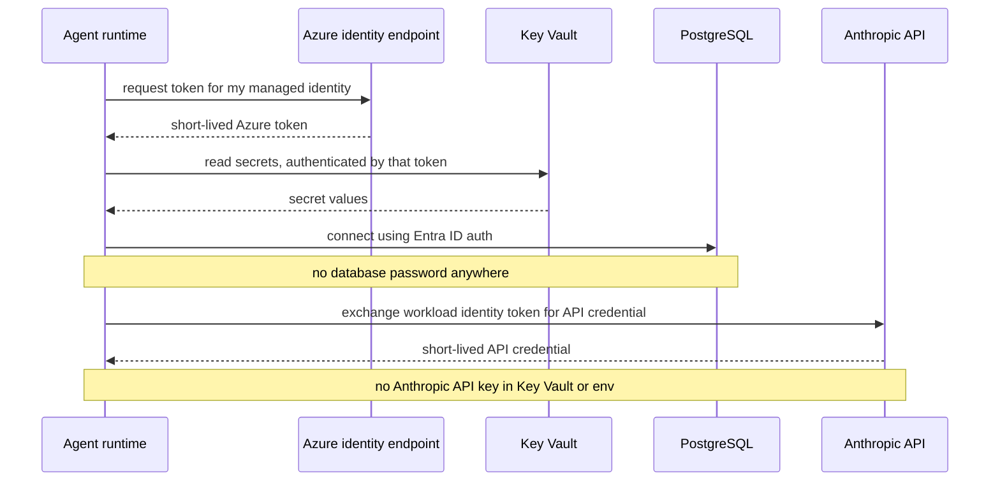
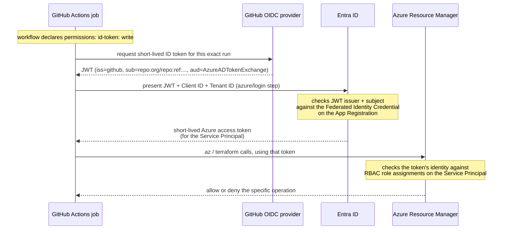

# job-search-infrastructure — Architecture

> Living document. Update the Decision Log whenever a `PROPOSED` becomes `DECIDED`.
> Cloud: **Azure** · IaC: **Terraform** · Purpose: interview-grade cloud evidence + a real agent that manages my job search.

---

## 1. Target architecture

**The one node designed to be replaced is `AGENT RUNTIME`.** Everything around it — network,
identity, secrets, database, CI/CD — stays identical whether that box is a Container Apps Job,
an AKS CronJob, or a VM. That is the whole point of the boundary (see §4).

---

## 2. Identity and secrets flow

The most interview-relevant part of the design, and the least visible on the diagram above.
**Nothing here stores a long-lived credential.**

Two things to be able to explain out loud:

1. **Why GitHub Actions uses OIDC federation instead of a stored service principal secret.** No
   secret to rotate, no secret to leak, and access is scoped to a specific repo and branch.
2. **Why the Anthropic credential is federated too.** Interactive login is for laptops. For
   unattended workloads the compute presents its own cloud identity and exchanges it for a
   short-lived credential. "I put the API key in Key Vault" is the *okay* answer; this is the
   good one. **Verify the exact Azure-side token mechanism before designing around it** — the
   shape differs between Container Apps and AKS, and that difference is a real input to §4.

### 2a. The CI/CD identity, in detail — GitHub Actions → Azure

This is a **different identity and a different flow** from the diagram above: the sequence
diagram above is the *running agent's* identity (Managed Identity, talking to Key Vault /
Postgres / Anthropic). This is the *pipeline's* identity — an **App Registration**, whose only
job is letting GitHub Actions run Terraform. Two separate authentications chained together, not
one.

The object map, since it's easy to blur these into one thing:

| Object | Job | Where it lives |
|---|---|---|
| App Registration | The identity's blueprint (Client ID, Tenant ID) | Entra ID |
| Federated Identity Credential | **Trust only** — which external token (issuer + subject) proves who this is. No permissions of its own. | A sub-resource of the App Registration |
| Service Principal | The actual actor RBAC roles attach to | Auto-created alongside the App Registration, same tenant |
| Role assignment | What the Service Principal is allowed to do | On the target resource / resource group |

**Note for Terraform specifically:** `azure/login` authenticates an Azure CLI session for the
job — it does **not** automatically authenticate Terraform's `azurerm` provider. That provider
needs its own separate OIDC-aware configuration alongside it.

---

## 3. Decision log

| # | Decision | Status | Reasoning |
|---|---|---|---|
| 1 | Cloud provider: **Azure** | `DECIDED` | Matches day job; healthcare employers skew Azure |
| 2 | IaC: **Terraform** | `DECIDED` | Portable, largest job-market surface |
| 3 | Database: **Azure Database for PostgreSQL — Flexible Server** | `PROPOSED` | See §5 — the "flavor" question is mostly already answered on Azure |
| 4 | Compute: **Container Apps Job, cron-scheduled** | `DECIDED` | Workload is scheduled + idle; scales to zero. AKS deferred to phase 2 — see §4 |
| 5 | Postgres access: private endpoint, no public access | `PROPOSED` | |
| 6 | DB auth: Entra ID, no password | `PROPOSED` | Verify support on the tier chosen in #3 |
| 7 | TF state: Azure Storage with native blob locking | `PROPOSED` | |
| 8 | Environments: one (`prod`) | `PROPOSED` | Personal scale; be ready to say why not three |

---

## 4. The compute decision — my recommendation, and the argument against it

You leaned Kubernetes because it reads as "high-level production." That instinct is half right,
and the half that's wrong will cost you both money and interview credibility.

**The case against AKS as your starting point:**

- **It doesn't fit the workload.** Your agent runs on a schedule and sits idle the rest of the
  time. A Kubernetes cluster keeps node VMs running 24/7 to host something that executes for a
  few minutes a day. A sharp interviewer will ask why, and "it seemed more production" is a bad
  answer.
- **It's the single biggest line on your bill.** The control plane has a free tier; the node pool
  does not. Verify current node VM pricing yourself, but expect the cluster to cost several times
  everything else in this diagram *combined*.
- **The complexity lands on the part you're not trying to learn.** You'd spend your first weeks on
  ingress, node pools, and Helm rather than on networking, identity, and data — the things this
  project exists to teach.

**The case for it:** AKS is on a very large share of Azure job postings, and "I've run a real
workload on Kubernetes" is a genuine résumé line.

**My recommendation — phase it, and make the phasing the story:**

- **Phase 1:** containerize the agent, run it as a scheduled Container Apps Job. Scales to zero,
  costs near nothing idle, and forces you to build every surrounding layer properly.
- **Phase 2:** move that *same image* onto AKS. Nothing else in the diagram changes.

This is strictly better than starting on AKS, because it hands you the best answer to the best
question you'll be asked: *"walk me through a time you changed a design decision and why."* You
get to talk about workload fit, cost, and a migration you actually performed — instead of
defending a cluster you spun up because clusters sound serious.

Your call. If you'd rather go straight to AKS, say so and I'll hold you to the cost tracking
instead of arguing.

---

## 5. The Postgres question — you're choosing a tier, not a flavor

On Azure this decision is smaller than you think. **Azure Database for PostgreSQL Flexible Server**
is the mainline managed Postgres offering; the older Single Server is retired, and Cosmos DB for
PostgreSQL is a distributed/Citus product aimed at a scale you do not have.

So the real choice is the **compute tier**, and "cheapest" points at the **Burstable** tier — the
smallest burstable SKU plus a small storage allocation. Two things to verify yourself:

- Whether your subscription qualifies for a **free tier / free trial allowance** on Flexible Server
  (there has historically been a 12-month allowance for new accounts — check current terms).
- Storage is billed separately from compute, and **backup retention beyond the included window
  costs extra**. Storage is also easier to grow than to shrink.

"Cheapest" is a fine criterion here. Just be able to state the trade-off you accepted: burstable
CPU credits mean sustained load throttles. For a job-application tracker that is irrelevant, and
saying so confidently *is* the correct interview answer.

---

## 6. Cost model

**Verify every number yourself on the Azure pricing calculator before you build.** These are
order-of-magnitude only, and pricing changes. Knowing how to price an architecture is itself the
interview skill.

| Item | Rough monthly | Notes |
|---|---|---|
| PostgreSQL Flexible Server, burstable | low tens | Check free-tier eligibility first |
| Container Apps Job | ~0 | Consumption has a monthly free grant; scales to zero |
| Container Registry, Basic | single digits | |
| Key Vault | ~0 | Priced per operation; negligible at this volume |
| Log Analytics | low single digits | Priced per GB ingested — set a retention cap |
| Storage (TF state) | ~0 | |
| **Traps to price before committing** | | |
| NAT Gateway | tens | Hourly charge *plus* per-GB. Easy to avoid at this scale — confirm you need it |
| Private Endpoints | few dollars each | Hourly per endpoint, plus data processing |
| Public IPv4 addresses | few dollars each | No longer free |
| Azure Firewall | **hundreds** | Never, for this project |
| AKS node pool | tens to low hundreds | The phase-2 decision, priced |
| **Anthropic token spend** | **budget separately** | Likely to exceed all infrastructure above |

---

## 7. What I still owe a decision on

- [x] Confirmed personal subscription in own tenant — `GabePersonal` / tenant `91f7038a-dde6-40e7-baaf-a748d56ffb7a` (`gabrielalexandermulerogm265.onmicrosoft.com`). Original sign-up had auto-joined the UTD tenant; resolved by creating a fresh Microsoft account.
- [ ] Confirm Flexible Server free-tier eligibility on my subscription
- [ ] Confirm Entra ID auth support on the chosen tier (decision #6 depends on it)
- [ ] Decide private endpoint vs. VNet integration for Postgres — and be able to say why
- [ ] Confirm the workload-identity token mechanism on Container Apps (§2)
- [ ] Decide whether outbound egress needs NAT at all, or can be handled without it
- [ ] Set a billing alert **before** creating the first resource

---

## 8. Learning objectives this build should produce

By the end I should be able to whiteboard, without notes:

1. Why the database has no public endpoint, and exactly how the agent reaches it
2. The full credential chain from GitHub Actions to Azure to Postgres to Anthropic — with no
   long-lived secret anywhere in it
3. What Terraform state is, why it needs locking, and what breaks without it
4. Why I chose burstable Postgres and what I gave up
5. Why the compute runtime is a swappable box, and what I'd change to move it to AKS
6. What my restore procedure is — and the date I last actually tested it
